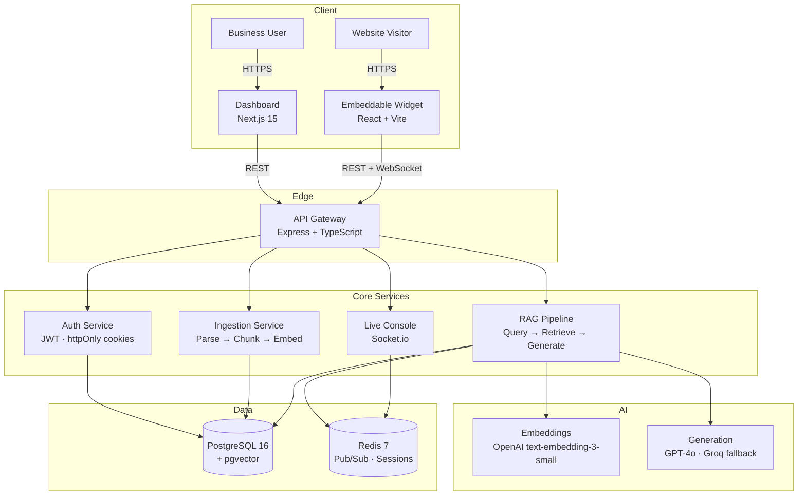
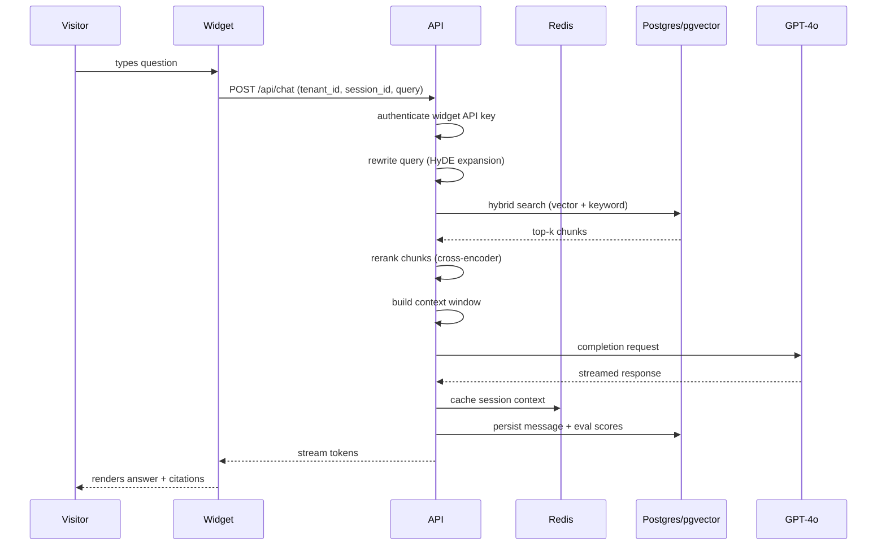
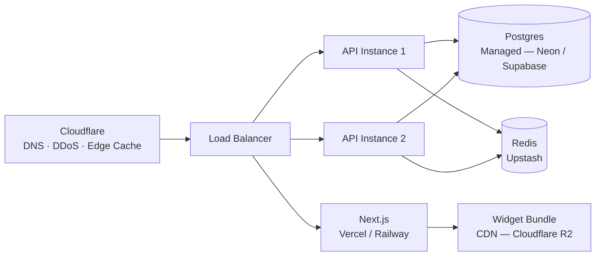

# System Architecture

AskBase is a multi-tenant SaaS platform built as a monorepo across three deployable apps and two shared packages. This document describes the top-level architecture, data flow, and deployment topology.

---

## High-Level Diagram

---

## App Boundaries

| App | Responsibility | Port |
|-----|---------------|------|
| `apps/api` | All business logic, auth, RAG, ingestion, WebSockets | 4000 |
| `apps/web` | Business dashboard, onboarding wizard, live agent console | 3000 |
| `apps/widget` | Embeddable chat UI served as a JS bundle | 5173 |

Apps share no runtime code directly. All cross-app communication goes through the API. Shared types live in `packages/shared` and are imported at build time only.

---

## Request Lifecycle — Chat Query

---

## Multi-Tenancy Model

Each tenant (business) is fully isolated at the data layer:

- **Knowledge base** — all documents, chunks, and embeddings are scoped by `tenant_id`
- **Vector search** — pgvector queries always include a `WHERE tenant_id = $1` predicate; no cross-tenant leakage is possible
- **Widget config** — appearance, behaviour, and confidence thresholds are stored per tenant
- **API keys** — each tenant has rotating API keys used to authenticate widget requests
- **Users** — role-based (Owner / Admin / Agent) scoped to the tenant

Tenants share the same database instance but are logically isolated. Infrastructure-level isolation (separate schemas or databases) is planned for Business-tier accounts in a future release.

---

## Deployment Topology (Production Target)

- API is stateless — any instance handles any request
- Sessions and pub/sub use Redis so WebSocket connections survive restarts
- Widget bundle is a static JS file served from CDN with long-lived cache headers

---

## Security Boundaries

| Surface | Control |
|---------|---------|
| Dashboard auth | httpOnly cookies, 15-min access token, 7-day refresh with silent rotation |
| Widget auth | Per-tenant API key sent in `Authorization` header, validated on every request |
| DB access | API only — no direct DB access from web or widget |
| Secrets | Environment variables only — never committed, never logged |
| CORS | Strict origin allowlist per tenant for widget requests |
| Rate limiting | Per-IP and per-tenant on all public endpoints via Redis token bucket |
