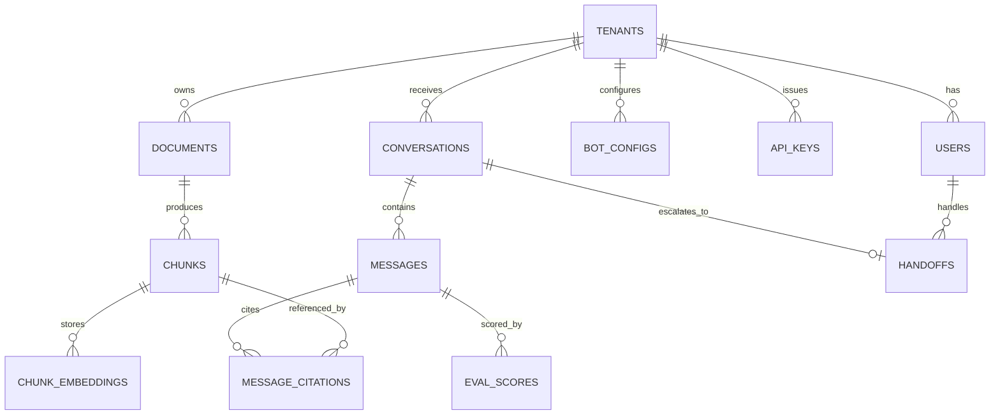

# Data Model

PostgreSQL 16 with pgvector. All tables use UUIDs as primary keys. Every tenant-scoped table includes a `tenant_id` foreign key — all queries are predicated on it.

---

## Entity Relationship



---

## Tables

### `tenants`
```sql
id              uuid PRIMARY KEY
name            text NOT NULL
slug            text UNIQUE NOT NULL        -- used in widget embed URL
plan            text NOT NULL DEFAULT 'free'
created_at      timestamptz DEFAULT now()
```

### `users`
```sql
id              uuid PRIMARY KEY
tenant_id       uuid REFERENCES tenants
email           text UNIQUE NOT NULL
password_hash   text NOT NULL
role            text NOT NULL              -- owner | admin | agent
created_at      timestamptz DEFAULT now()
```

### `api_keys`
```sql
id              uuid PRIMARY KEY
tenant_id       uuid REFERENCES tenants
key_hash        text UNIQUE NOT NULL       -- bcrypt hash, never stored plaintext
prefix          text NOT NULL              -- first 8 chars shown in UI (e.g. ask_a1b2...)
label           text
last_used_at    timestamptz
created_at      timestamptz DEFAULT now()
```

### `documents`
```sql
id              uuid PRIMARY KEY
tenant_id       uuid REFERENCES tenants
name            text NOT NULL
source_type     text NOT NULL              -- pdf | url | text
source_url      text
file_path       text
status          text NOT NULL DEFAULT 'pending'  -- pending | processing | ready | failed
chunk_count     int DEFAULT 0
created_at      timestamptz DEFAULT now()
```

### `chunks`
```sql
id              uuid PRIMARY KEY
document_id     uuid REFERENCES documents
tenant_id       uuid REFERENCES tenants
content         text NOT NULL
summary         text
keywords        text[]
chunk_index     int NOT NULL
token_count     int NOT NULL
metadata        jsonb DEFAULT '{}'
created_at      timestamptz DEFAULT now()
```

### `chunk_embeddings`
```sql
id              uuid PRIMARY KEY
chunk_id        uuid REFERENCES chunks
tenant_id       uuid REFERENCES tenants
embedding       vector(1536) NOT NULL      -- pgvector
model           text NOT NULL DEFAULT 'text-embedding-3-small'
created_at      timestamptz DEFAULT now()

-- Index
CREATE INDEX ON chunk_embeddings
  USING ivfflat (embedding vector_cosine_ops)
  WITH (lists = 100);
```

### `conversations`
```sql
id              uuid PRIMARY KEY
tenant_id       uuid REFERENCES tenants
session_id      text NOT NULL              -- visitor session, set by widget
customer_email  text
status          text DEFAULT 'open'        -- open | resolved | escalated
created_at      timestamptz DEFAULT now()
resolved_at     timestamptz
```

### `messages`
```sql
id              uuid PRIMARY KEY
conversation_id uuid REFERENCES conversations
tenant_id       uuid REFERENCES tenants
role            text NOT NULL              -- user | assistant | agent
content         text NOT NULL
confidence      float                      -- null for user messages
created_at      timestamptz DEFAULT now()
```

### `eval_scores`
```sql
id              uuid PRIMARY KEY
message_id      uuid REFERENCES messages
faithfulness    float NOT NULL
relevance       float NOT NULL
confidence      float NOT NULL
flagged         boolean DEFAULT false
created_at      timestamptz DEFAULT now()
```

### `message_citations`
```sql
id              uuid PRIMARY KEY
message_id      uuid REFERENCES messages
chunk_id        uuid REFERENCES chunks
position        int NOT NULL               -- [Source N] index in response
```

### `handoffs`
```sql
id              uuid PRIMARY KEY
conversation_id uuid REFERENCES conversations
agent_id        uuid REFERENCES users
trigger_reason  text                       -- low_confidence | user_request | keyword
created_at      timestamptz DEFAULT now()
resolved_at     timestamptz
resolution_note text
```

### `bot_configs`
```sql
id                  uuid PRIMARY KEY
tenant_id           uuid REFERENCES tenants UNIQUE
name                text NOT NULL DEFAULT 'Assistant'
system_prompt       text
confidence_threshold float DEFAULT 0.65
primary_color       text DEFAULT '#6366f1'
widget_position     text DEFAULT 'bottom-right'
welcome_message     text
created_at          timestamptz DEFAULT now()
```

---

## Indexes

```sql
-- Tenant-scoped lookups (on every hot query path)
CREATE INDEX idx_chunks_tenant         ON chunks (tenant_id);
CREATE INDEX idx_conversations_tenant  ON conversations (tenant_id);
CREATE INDEX idx_messages_conversation ON messages (conversation_id);
CREATE INDEX idx_eval_scores_message   ON eval_scores (message_id);

-- Full-text search (BM25 approximation for hybrid retrieval)
ALTER TABLE chunks ADD COLUMN fts tsvector
  GENERATED ALWAYS AS (to_tsvector('english', content)) STORED;
CREATE INDEX idx_chunks_fts ON chunks USING gin(fts);
```
