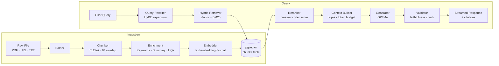
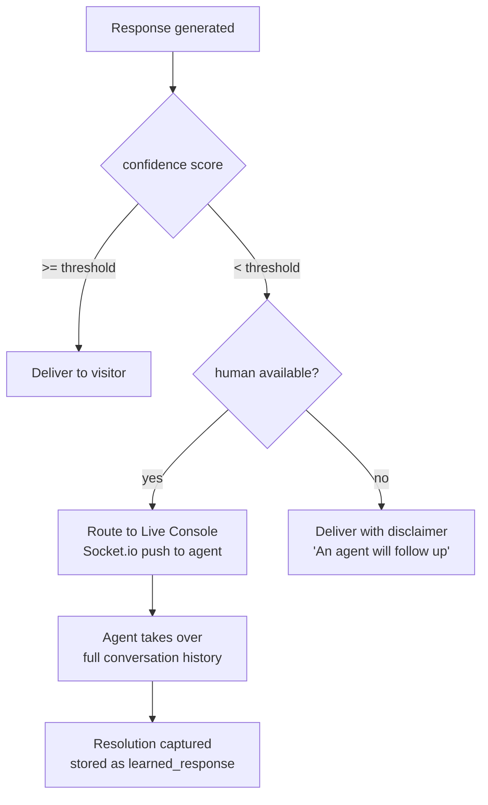

# RAG Pipeline

This document describes the full Retrieval-Augmented Generation pipeline — from raw document upload to a streamed, cited answer.

---

## Pipeline Overview

---

## Stage 1 — Ingestion

### Parsing
Supports three input types:
- **PDF** — `pdf-parse`, extracts raw text per page
- **URL** — `cheerio` scrape, strips nav/footer/boilerplate, extracts main content
- **Plain text** — direct ingestion

All parsers normalise to a single `{ text, metadata }` structure before chunking.

### Chunking
- **Strategy**: recursive character splitting
- **Chunk size**: 512 tokens
- **Overlap**: 64 tokens (preserves context across chunk boundaries)
- **Minimum chunk**: 100 tokens (sub-threshold fragments are discarded)

Each chunk stores: `content`, `document_id`, `tenant_id`, `chunk_index`, `token_count`, `metadata`.

### Enrichment (Groq LLaMA-3)
Each chunk is sent to a fast LLM for metadata enrichment before embedding:
- **Keywords** — 5–8 terms for BM25 indexing
- **Summary** — one-sentence distillation for display in citations
- **Hypothetical questions** — 3 questions this chunk could answer (improves recall)

Enrichment is async and non-blocking — chunks are queryable immediately after embedding.

### Embedding
- **Model**: `text-embedding-3-small` (1536 dimensions)
- **Input**: `chunk.content + chunk.summary` concatenated for richer signal
- **Storage**: pgvector `vector(1536)` column with `ivfflat` index (`lists=100`)

---

## Stage 2 — Retrieval

### Query Rewriting — HyDE
Before retrieval, the raw query is expanded using **Hypothetical Document Embeddings**:

1. LLM generates a hypothetical ideal answer to the query (~100 tokens)
2. That hypothetical answer is embedded alongside the original query
3. Both embeddings are averaged to produce a retrieval vector that points toward the answer space rather than the question space

This significantly improves recall for short or ambiguous queries.

### Hybrid Search
Retrieval runs two searches in parallel:

| Method | Mechanism | Weight |
|--------|-----------|--------|
| Vector | cosine similarity on pgvector | 0.7 |
| Keyword | `tsvector` full-text search (BM25 approximation) | 0.3 |

Results are merged using Reciprocal Rank Fusion (RRF) before reranking.

### Reranking
The merged candidate set (top-20) is passed through a cross-encoder reranker:
- Scores each `(query, chunk)` pair for relevance
- Re-orders by reranker score, not retrieval score
- Top-5 chunks are selected for context

---

## Stage 3 — Generation

### Context Builder
Assembles the prompt within a strict token budget:
- System prompt: persona, grounding rules, citation format
- Retrieved chunks: ordered by reranker score, each tagged with `[Source N]`
- Conversation history: last 6 turns (3 user + 3 assistant)
- Total budget: 6,000 tokens (leaves room for generation within model limits)

### Generation
- **Primary**: `gpt-4o` — used when tenant is on a paid plan or within free quota
- **Fallback**: `groq/llama-3-70b-8192` — lower latency, used during OpenAI outages or rate limits
- **Streaming**: tokens streamed via Server-Sent Events to the widget
- **Temperature**: 0.2 — low for factual, grounded responses

### Grounding Rules (System Prompt)
The model is instructed to:
- Only use information present in the provided context
- Always cite sources using `[Source N]` inline
- Say "I don't have information about that" if the context is insufficient
- Never fabricate URLs, prices, dates, or named entities

---

## Stage 4 — Evaluation

Every response is scored asynchronously after streaming:

| Metric | Method | Threshold |
|--------|--------|-----------|
| **Faithfulness** | LLM judge — does the answer contradict the context? | > 0.8 |
| **Relevance** | Cosine similarity between query embedding and response embedding | > 0.6 |
| **Confidence** | Combined faithfulness × relevance | > 0.65 |

If `confidence < threshold`, the conversation is flagged and optionally routed to a human agent (configurable per tenant in dashboard settings).

Evaluation scores are stored per message and surfaced in the analytics dashboard.

---

## Confidence-Based Handoff

